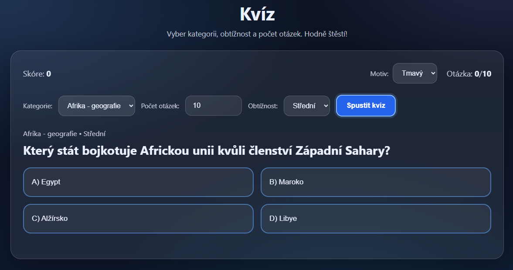

# Quiz Flask 🎓



Jednoduchá webová kvízová aplikace vytvořená pomocí frameworku **Flask** s frontendem v **HTML, CSS a JavaScriptu**.  
Na začátku si uživatel zvolí **kategorii**, **obtížnost** a **počet otázek**. Otázky se během jedné relace **neopakují** a po dokončení kvízu uživatel získá **finální skóre a procentuální úspěšnost**.

Aplikace také umožňuje přepínání mezi **tmavým a světlým motivem**. Zvolený motiv se ukládá v prohlížeči pomocí **localStorage**, takže zůstane zachovaný i po obnovení stránky.

Tento projekt byl vytvořen především jako **výuková aplikace** pro demonstraci komunikace mezi backendem a frontendem.

---

## 🚀 Instalace a spuštění

### 1. Naklonování repozitáře

```bash
git clone https://github.com/your-username/quiz-flask
cd quiz-flask
```

### 2. Vytvoření virtuálního prostředí (doporučeno)

```bash
python -m venv venv
```

**Windows**

```bash
venv\Scripts\activate
```

**macOS / Linux**

```bash
source venv/bin/activate
```

### 3. Instalace závislostí

```bash
pip install -r requirements.txt
```

### 4. Spuštění aplikace

```bash
python app.py
```

### 5. Otevření v prohlížeči

http://127.0.0.1:5000

---

## 🎯 Funkce

* Výběr kategorie kvízu
* Volba obtížnosti (easy / medium)
* Nastavení počtu otázek
* Náhodné načítání otázek z JSON souboru
* Odpovědi typu multiple choice (A / B / C / D)
* Počítání skóre
* Výpočet procentuální úspěšnosti
* Automatické ukončení hry
* Možnost restartovat kvíz
* Žádné opakování otázek během jedné relace

---

## 🛠 Použité technologie

### Backend

* **Python**
* **Flask**

### Frontend

* **HTML** – struktura stránky
* **CSS** – vzhled a stylování
* **JavaScript** – herní logika a komunikace s API

### Data

* **JSON** – databáze otázek

---

## ⚙️ Jak aplikace funguje

### Architektura

Aplikace je rozdělena na **backend** a **frontend**, které spolu komunikují pomocí jednoduchého REST API.

---

### Backend (Flask – `app.py`)

* Načítá otázky ze souboru `questions.json`
* Filtruje otázky podle:

  * kategorie
  * obtížnosti
  * již použitých ID
* Vrací náhodné otázky přes API endpoint (např. `/api/question`)
* Zajišťuje, že:

  * otázky se neopakují
  * data nejsou přímo dostupná v HTML

---

### Frontend (JavaScript – `app.js`)

* Komunikuje s backendem přes REST API
* Zobrazuje otázky a odpovědi
* Vyhodnocuje odpovědi uživatele
* Sleduje:

  * aktuální skóre
  * počet zodpovězených otázek
* Řídí průběh hry:

  * přepínání mezi otázkami
  * ukončení hry
  * restart kvízu

---

## 📌 Stav projektu

Projekt je **plně funkční** a **snadno rozšiřitelný**.

Slouží jako výukový projekt pro:

* základy vývoje backendu ve **Flasku**
* práci s **JSON daty**
* pochopení role **JavaScriptu ve webových aplikacích**
* základní workflow v **Git a GitHubu**
* oddělení frontendové a backendové logiky

---

## 🚀 Možná budoucí vylepšení

* Přidání databáze (SQLite / PostgreSQL)
* Uživatelské účty a ukládání skóre
* Správa otázek (admin panel)
* Časový limit pro odpovědi
* Další úrovně obtížnosti
* Migrace na FastAPI nebo frontend framework

---

## 🧪 Přístup k vývoji

Tento projekt byl částečně vyvíjen pomocí rychlého iterativního přístupu (někdy označovaného jako **„vibe coding“**), který se zaměřuje na experimentování a průběžné vylepšování namísto striktního návrhu předem.

Cílem bylo rychle prototypovat nápady a následně je zlepšovat pomocí praxe a iterací.